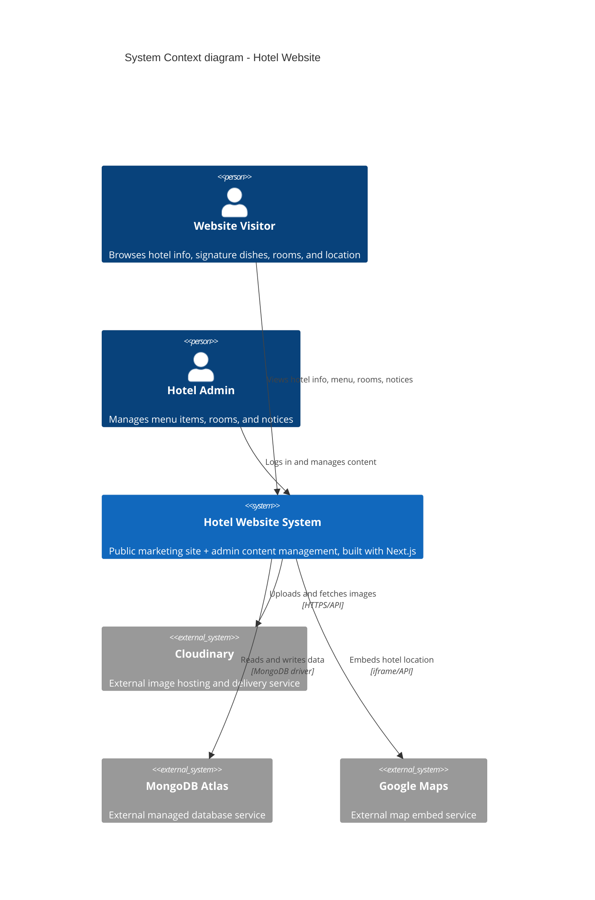

# System Context Diagram (C4 Level 1)

This is the highest-level view of the Hotel Website system. It shows who uses
the system and which external systems it depends on — no internal technical
detail yet. See `02-container.md` for the next zoom level.

## Reading this diagram

- **Person** shapes = human actors interacting with the system
- **System** (the central box) = the system we are building — treated as a
  black box at this zoom level
- **System_Ext** shapes = external systems we depend on but do not build
  ourselves
- **Rel** = a relationship/interaction, always labeled with what happens and
  (optionally) how

## Why this matters for future upgrades

When Phase 2+ features are added (booking, food ordering, payment gateway),
this diagram gets one more `System_Ext` box (e.g. `Payment Gateway`) and one
more `Rel` line — the rest of the diagram doesn't change. That stability is
the point of starting at this zoom level.
