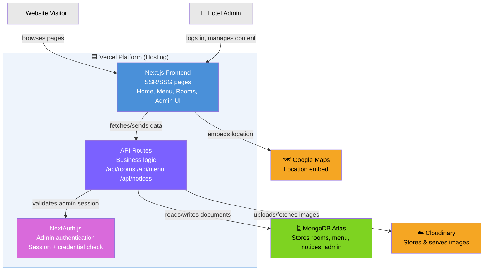

# Container Diagram (C4 Level 2)

This zooms into the "Hotel Website System" box from the Context diagram
(`01-context.md`) and shows the major technical containers inside it, and
what each one talks to. See `03-component.md` for the next zoom level,
which opens up the API Routes container specifically.

## Reading this diagram

- **Vercel platform** (outer box) hosts three internal containers: the
  Next.js frontend, the API routes, and NextAuth's session handling.
- The **frontend never talks to MongoDB or Cloudinary directly** — every
  data operation goes through the API routes. This is a rule for coders
  to follow when implementing: no direct DB/Cloudinary calls from React
  components.
- **NextAuth** sits between the API routes and every write operation,
  checking session validity before any create/update/delete proceeds.

## Why this matters for future upgrades

Adding a Payment Gateway or a Booking/Ordering system later means adding
new containers (or external systems) at this same level — e.g. a
`Payment Gateway` external system connected to a new `/api/bookings`
route — without altering the Frontend/API/Auth structure already in
place.
