# Component Diagram (C4 Level 3)

This zooms into the **API Routes** container from the Container diagram
(`02-container.md`) — the deepest C4 level, showing individual route
handlers, middleware, and the models they touch. This is the level coders
reference most while writing backend code.

```mermaid
flowchart TB
    subgraph client["Incoming Request"]
        req["Frontend or Admin UI<br/>HTTP request"]
    end

    subgraph apiRoutes["API Routes Container"]
        subgraph roomsRoute["/api/rooms"]
            roomsGet["GET - list all rooms"]
            roomsPost["POST - create room (admin)"]
            roomsPut["PUT /:id - update room (admin)"]
            roomsDelete["DELETE /:id - delete room (admin)"]
        end

        subgraph menuRoute["/api/menu"]
            menuGet["GET - list all menu items"]
            menuPost["POST - create item (admin)"]
            menuPut["PUT /:id - update item (admin)"]
            menuDelete["DELETE /:id - delete item (admin)"]
        end

        subgraph noticeRoute["/api/notices"]
            noticeGet["GET - list active notices"]
            noticePost["POST - create notice (admin)"]
            noticeToggle["PATCH /:id - toggle active (admin)"]
            noticeDelete["DELETE /:id - delete notice (admin)"]
        end

        authMiddleware["Auth Middleware<br/>Checks admin session via NextAuth<br/>Blocks POST/PUT/PATCH/DELETE if not logged in"]
    end

    subgraph models["Mongoose Models"]
        roomModel["Room model"]
        menuModel["MenuItem model"]
        noticeModel["Notice model"]
    end

    mongo["MongoDB Atlas"]
    cloudinary["Cloudinary"]

    req --> roomsRoute
    req --> menuRoute
    req --> noticeRoute

    roomsPost -.-> authMiddleware
    roomsPut -.-> authMiddleware
    roomsDelete -.-> authMiddleware
    menuPost -.-> authMiddleware
    menuPut -.-> authMiddleware
    menuDelete -.-> authMiddleware
    noticePost -.-> authMiddleware
    noticeToggle -.-> authMiddleware
    noticeDelete -.-> authMiddleware

    roomsRoute --> roomModel
    menuRoute --> menuModel
    noticeRoute --> noticeModel

    roomModel --> mongo
    menuModel --> mongo
    noticeModel --> mongo

    roomsPost --> cloudinary
    roomsPut --> cloudinary
    menuPost --> cloudinary
    menuPut --> cloudinary

    style authMiddleware fill:#D96ADB,color:#fff
    style roomModel fill:#7ED321,color:#000
    style menuModel fill:#7ED321,color:#000
    style noticeModel fill:#7ED321,color:#000
    style mongo fill:#4A90D9,color:#fff
    style cloudinary fill:#F5A623,color:#000
```

## Reading this diagram

- Every route follows the same pattern: **GET is public** (no auth check),
  but **POST/PUT/PATCH/DELETE all pass through the auth middleware first**
  (dashed lines = "checked by," not "flows to").
- Each route only ever touches its own model — `/api/rooms` never touches
  `MenuItem`, keeping modules independent and easy to extend later.
- Image-related actions (create/update room or menu item) are the only
  ones that call Cloudinary.

## Auth Middleware, explained

Middleware is code that runs between a request arriving and the actual
route logic executing — like a guard at a door. For every write request:
1. Look for the NextAuth session token on the incoming request.
2. Ask NextAuth whether it's a valid, currently logged-in session.
3. If valid, let the request continue to the real route logic.
4. If not valid, reject immediately with `401 Unauthorized` — the route
   logic never runs.

Read operations (GET) skip this entirely since viewing data is harmless
and should stay public for site visitors.
